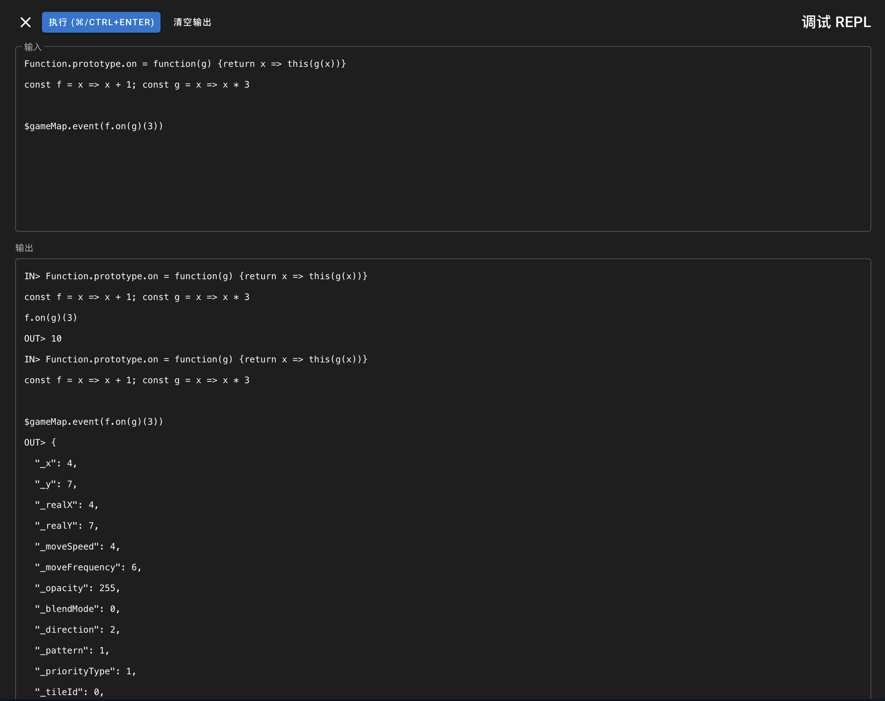
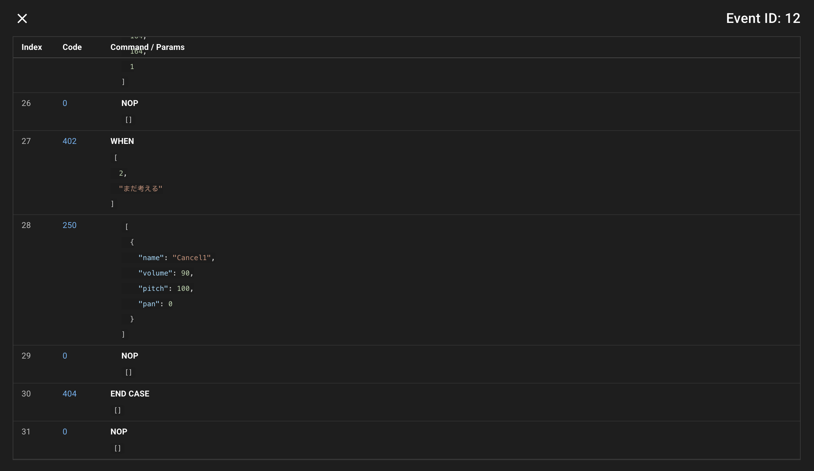

# RPG-Maker-MV-MZ-Cheat-UI-Plugin

基于 [Justype/RPG-Maker-MV-MZ-Cheat-UI-Plugin](https://github.com/Justype/RPG-Maker-MV-MZ-Cheat-UI-Plugin)、[paramonos/RPG-Maker-MV-MZ-Cheat-UI-Plugin](https://github.com/paramonos/RPG-Maker-MV-MZ-Cheat-UI-Plugin) 修改而来。

变化：

1. （当前的）事件查看器
2. REPL
3. 修复一些 bug
4. 去除原本的 build script，用 makefile 重写。`package.json` 则用于 [Shiki](https://shiki.style/) 的 fine-grained bundling.

可通过 [CI](https://github.com/notch1p/RPG-Maker-MV-MZ-Cheat-UI-Plugin/actions) 下载 artifact.

